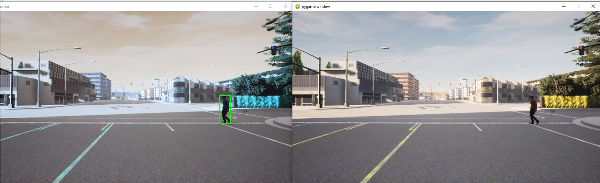

# Carla Pedestrian Detection
This pedestrian detection uses YOLO and cv2


 
## Steps:

1. Get this repository in carla-simulator\PythonAPI\examples.
  It should look like this:
  
```
.CARLA_0.9.13            
├── carla-simulator
│   │   ├── CarlaUE4
│   │   ├── Co-Simulation
│   │   ├── Engine
│   │   ├── PythonAPI
│   │   │   ├── carla
│   │   │   ├── util
│   │   │   ├── examples
│   │   │   │ 	├── carla-pedestrian.py
│   │   │   │ 	├── coco.names
│   │   │   │ 	├── yoloyv4-tiny.cfg
│   │   │   │ 	├── yoloyv3-tiny.weights
│   │   │   │ 	├── tensorflow_yolov3    
│   │   │   │ 	│   │  	├── core
│   │   │   │ 	│   │	│   ├── utils.py 
          
```

2. You are supposed to install some dependencies before getting out hands with these codes.

```	$ cd tensorflow-yolov3
		$ pip install -r ./docs/requirements.txt 
```

3. Download COCO weights in carla-simulator/PythonAPI/examples/tensorflow_yolov3/checkpoint:

	```
	$ wget https://github.com/YunYang1994/tensorflow-yolov3/releases/download/v1.0/yolov3_coco.tar.gz

	```
	extract the file:

	``` $ tar -xvf yolov3_coco.tar.gz
			$ cd ..
			$ python convert_weight.py
			$ python freeze_graph.py
			```
	
4. Run spawn actor python file for  adding pedestrians or vehicles.

	```python generate_traffic.py```

5. Run pedestrian detection code

 	```python carla-pedestrian.py```

You should see two windows like this:


Control the car in the pygame window with WASD keys
